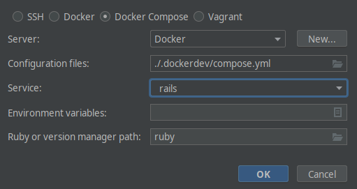

# CRUD demo

This little Rails demo application shows CRUD forms for several configurations:

* model not namespaced, controller not namespaced
* model namespaced, controller not namespaced
* model not namespaced, controller namespaced
* model namespaced, controller namespaced

In all configurations, the model namespace should not be part of the URL
(which added additional hurdles).

This little application is a product by the
[Brain Gourmets](http://www.braingourmets.com/).

## Local development

### Initial setup

1. Install [Docker and Docker Compose](https://www.docker.com/).
1. Install [Dip](https://github.com/bibendi/dip#precompiled-binary).
1. Check out the Git repository.
1. `dip provision`

The last step will build the containers, create a local configuration file
(if none is present), build the containers, install the Gems and yarn
packages, create the development and test databases and create dummy records
in the development database.

### RubyMine setup

Create a new remote Ruby SDK in the settings and set is as the default.

In the following dialog, select "Docker Compose" with the configuration file
`./.dockerdev/compose.yml` in the service `rails`:

After that, you can set up the Ruby Docker integration:

#### RuboCop integration

This also should work out of the box.

#### Development Rails server configuration

In the (default) Rails runner configuration, make sure that the server type
is "default" and that docker-compose uses "docker-compose exec":

### Common tasks

| Command               |                                           |
|-----------------------|-------------------------------------------|
| `dip`                 | list the available dip commands           |
| `dip bundle …`        | run `bundler`                             |
| `dip compose …`       | run a docker-compose command              |
| `dip compose build`   | (re)build the containers                  |
| `dip compose ps`      | list the running containers               |
| `dip down`            | shut down all containers                  |
| `dip rails c`         | run the rails console                     |
| `dip rails migrate`   | run DB migrations                         |
| `dip rails s`         | run the rails server                      |
| `dip rails …`         | run any rake task                         |
| `dip sa`              | run all static code analysis checks       |
| `dip bash`            | open a shell into the `rails` container   |
| `dip up -d webpacker` | run Webpacker in the background           |
| `dip yarn …`          | run `yarn`                                |
| `docker system prune` | prune all images, containers and networks |

### Running the development webserver

To avoid that Rails needs to compile the assets on the first request, please
start the Webpacker watcher in the background before running the Rails
server:

1. `dip up -d webpacker`
1. `dip rails s`

## Rake tasks

To run the rake tasks within the container, please use `dip rails …`.
